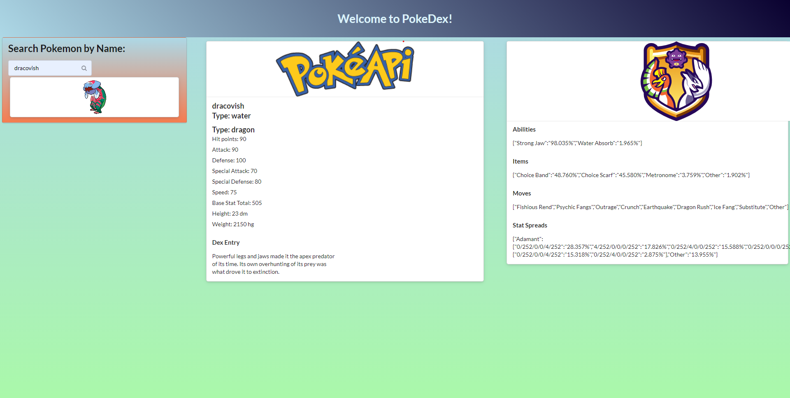

# <center>

# Welcome to Project One - "The PokeDex"


<center>

## Introduction

</center>
* The Pokedex is any Pokemon Trainer's best friend when it comes to finding information about the monsters they encounter on their journey to becoming Champion. 

<center>

## Team Members

</center>
<center>

> [Allen Ladd](https://github.com/Aladd616)

> [Alyson Orta](https://github.com/alysonorta)

> [Carla Kinley-Davis](https://github.com/ckinleydavis)

> [CJ Trahey](https://github.com/cjtrahey)

</center>
<center>

## Product

</center>

* The [PokeDex](https://www.pokemon.com/us/pokedex/) is something that everyone that has ever played a Pokemon game is familiar with. It shows the species name, entry number, image, height, and weight. However, almost none of those are relevant to a player that wants to go the distance with that species. What is a competitive player going to do with a Pokemon's height?

<center>

## Solution

</center>

* Our solution was taking the established PokeDex, and adding more information to it that players would actually use. Sure, knowing a species' height would be nice for Trivia Night, but in-game? It doesn't matter to the core gameplay mechanics, which is battling. Our PokeDex adds information ready to go at a moment's notice as soon as the user types in a Pokemon's name.

<center>

## Concept

</center>

* The user types in a Pokemon species' name and is presented with information
* This information is much more useful than the default PokeDex, as it displays useful and relevant stats to the particular species, such as its most common move and it's best base stat.
* It is quick information for both casual players and competitive players, the latter of which usually work on time constraints per move.
<p>
<br>
As a group, we beleive that Pokemon players need a quick and easy way to search for up-to-date statistics on their favorite Pokemon species.

<center>

## User Story

</center>

 * AS a Pokemon player
* I want to be able to input a Pokemon species' name and retrieve relevant information
* SO THAT I can determine the Pokemon's value.


<center>

## Simplified Mechanics

</center>

* This project was relatively simple in terms of concept, but much more difficult to execute in practice. 
* Essentially, there are two API calls happening at the same time, both pulling from the entry the user makes. For example, an entry of "Shuckle" would create a data call for both the entry stats of the species and the competitive data for it.
<p>
<br>
The following script excerpts are what generates the PokeDex entry and the base stats of the entered Pokemon:

```
//This Function calls for the basic entry for the Pokemon

var generalPokedex = function (pokemon) {
    var pokeApi = 'https://pokeapi.co/api/v2/pokemon-species/'+pokemon+'/';

    fetch(pokeApi)
        .then(function (response) {
            if (response.ok) {
                console.log(response);
                response.json().then(function (data) {
                    console.log(data);
                    
                    const entry = data.flavor_text_entries.find(fte=>fte.language.name ==='en')
                    console.log(entry)

                    
                })
            }
        })
    }

```

```

// This function calls for the species' base stats

var Stats = function (pokemon) {
    var baseStats = 'https://pokeapi.co/api/v2/pokemon/'+pokemon+'/';

    fetch(baseStats)
        .then(function (response) {
            if (response.ok) {
                console.log(response);
                response.json().then(function (data) {
                    console.log(data);

                var hp = Number(data.stats[0].base_stat);

                var attack = Number(data.stats[1].base_stat);

                var defense = Number(data.stats[2].base_stat);

                var special_att = Number(data.stats[3].base_stat);

                var special_def = Number(data.stats[4].base_stat);

                var speed = Number(data.stats[5].base_stat);
                // creates base stat total from stat values obtained from api
                var bst = hp + attack + defense + special_att + special_def + speed;

                var height = data.height;
                var weight = data.weight;

                var sprite = data.sprites.front_default;
```

<center>

## Technologies

</center>

The following technologies were used in the creation of this group project:
* HTML
* CSS
* JavaScript
* >[PokeAPI](https://pokeapi.co/)
* >[Smogon Usage API](https://smogon-usage-stats.herokuapp.com/)
* >[Semantic UI](https://semantic-ui.com/)

<center>

## Example

</center>
    
<p><br>
Wireframe proposal:
<p><br>
    


<p><br>

Final Project:
<br>




<center>

## Future Technologies

</center>

In the future, further development on this project would include:

* Background colors dynamically changing based on the Pokemon's typing (e.g. Pikachu's background being yellow because it is an Electric type.)

* Adding dropdown lists for search history and competitive tierings.

* Adding in-game background music to the website to further drive the "research" theme the PokeDex represents.

## Documentation

> [Slideshow Presentation](https://docs.google.com/presentation/d/1DJauHTWUznmujo3_CKTUlO700YPjpPNrnjOPGYvZL_M/edit?usp=sharing)

> [PokeAPI](https://pokeapi.co/)

> [Smogon Usage Stats](https://smogon-usage-stats.herokuapp.com/)
<p>
<br>
<center>
This app is not affiliated, endorsed or supported by Nintendo in any way, also some images used in this app are copyrighted and supported under fair use, Pokemon and Pokemon character names are trademark of Nintendo, no copyright infringement intended. Pokemon (C) 2002-2020 Pokemon.
</center>
        

